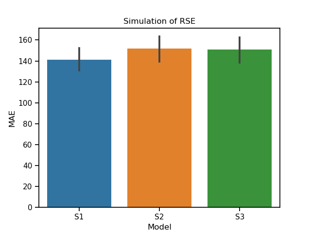

# The implementation of Representational Similarity Encoding

This is the python implementation of Representational Similarity Encoding in Anderson et al., (2016). The estimator partially complies with `scikit-learn`.

## Simulation
We can test the estimator using a random dataset.

```
python simulator.py
```



## Reference
Anderson, A. J., Zinszer, B. D., & Raizada, R. D. S. (2016). 
Representational similarity encoding for fMRI: Pattern-based synthesis 
to predict brain activity using stimulus-model-similarities. 
NeuroImage, 128, 44–53. 
https://doi.org/10.1016/j.neuroimage.2015.12.035
